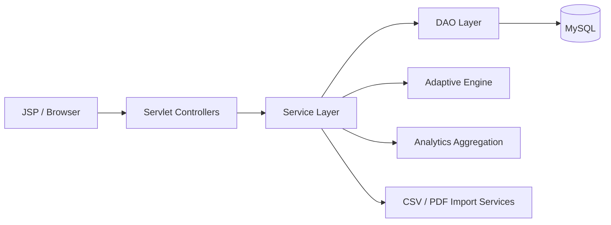
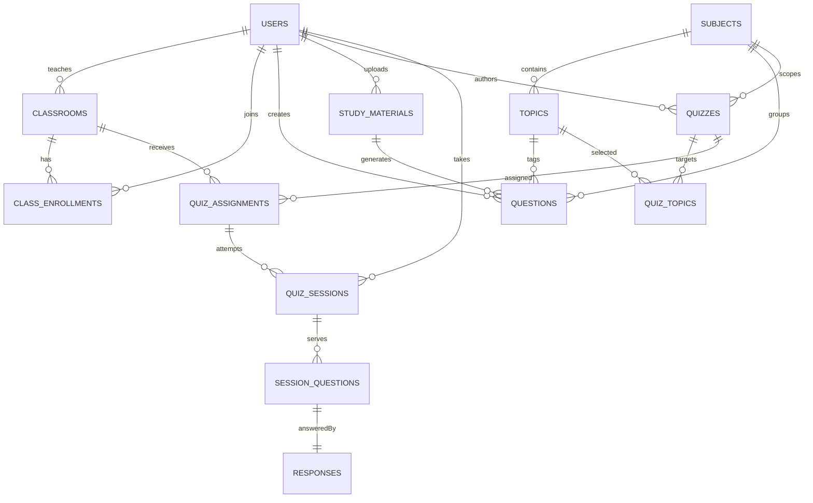

# Smart Adaptive Assessment Platform V3

## Goal

Move the current project from a single-user adaptive quiz app into a classroom assessment platform built for:

- Teachers who manage classes, question banks, quizzes, and analytics
- Students who receive assigned quizzes, resume attempts, and track progress
- Academic content organized by subject and topic instead of a single free-text category

The existing stack remains the same:

- Java Servlets for controllers
- JSP/JSTL for views
- Service layer for business rules
- DAO/JDBC layer for persistence
- MySQL for relational storage

## What Changes From The Current App

The current codebase already gives us a useful foundation:

- Authentication and session handling
- Adaptive session concept
- DAO/service/controller separation
- Question CRUD
- PDF-based content ingestion

The parts that should be retired or replaced are:

- `USER`/`ADMIN` as the long-term product roles
- Free-text `questions.category` as the only taxonomy
- A single `quiz_sessions` table trying to represent quiz template, assignment, and student attempt at once
- Practice-first student flow as the main experience
- Old orphaned PDF upload artifacts that were no longer wired to the active admin flow

## Target Domain Model

### Roles

- `TEACHER`: owns classes, question banks, quizzes, and analytics
- `STUDENT`: joins classes, receives assigned quizzes, takes attempts, views progress

### Content hierarchy

- `Subject`
- `Topic`
- `Question`

Supported seed subjects:

- Object-Oriented Programming (Java)
- Software Engineering
- Automata Theory
- Database Management Systems

### Assessment hierarchy

- `Quiz`: reusable teacher-authored assessment blueprint
- `QuizAssignment`: a quiz assigned to a class with availability and deadline
- `QuizSession`: one student attempt for one assignment
- `SessionQuestion`: the exact questions served to that student
- `Response`: the submitted answer for a served question

## High-Level Architecture



### Recommended modules

- `auth`: login, logout, registration/invites
- `teacher.classroom`: class creation, join code generation, student roster
- `teacher.questionbank`: manual question CRUD, CSV import, PDF ingestion review
- `teacher.quiz`: quiz creation, topic selection, assignment scheduling
- `student.dashboard`: assigned, completed, missed quizzes
- `student.session`: timed quiz flow, resume, auto-submit
- `analytics`: student progress and teacher reports

## Database Design

The target schema is captured in [schema_v3_classroom_platform.sql](</Users/atharva/Documents/java cp/SmartAdaptiveAssessment/sql/schema_v3_classroom_platform.sql:1>).

### Relationship summary



### Core tables

- `users`: teacher/student accounts, status, password hash, timestamps
- `subjects`: master subject list
- `topics`: topics under each subject
- `classrooms`: teacher-owned class shells like `SE Sem 3`
- `class_enrollments`: student-to-class mapping
- `study_materials`: uploaded PDFs and extracted content metadata
- `question_import_batches`: CSV import audit trail
- `questions`: normalized question bank with subject/topic/difficulty/source/status
- `question_options`: answer options stored in rows instead of fixed columns
- `quizzes`: teacher-authored quiz templates
- `quiz_topics`: topics included in a quiz plus target counts/weights
- `quiz_assignments`: class-specific publishing windows and deadlines
- `quiz_sessions`: one student attempt with timer snapshot, resume state, score counters
- `session_questions`: exact served questions, order, difficulty, immutable snapshot
- `responses`: selected option, correctness, answer timing
- `student_topic_mastery`: cached progress by student/topic for analytics

## Controller Flow

### Authentication

- `AuthServlet`
  - `GET /login`
  - `POST /login`
  - `POST /logout`

### Teacher area

- `TeacherDashboardServlet`
  - dashboard cards and summary analytics
- `ClassroomServlet`
  - create class
  - list roster
  - generate class code
  - manual student add
- `QuestionBankServlet`
  - list/filter questions
  - create/edit/archive question
  - CSV upload
- `StudyMaterialServlet`
  - upload PDF
  - review generated questions before publish
- `QuizBuilderServlet`
  - create quiz template
  - select subject/topics/question count/time limit
- `QuizAssignmentServlet`
  - assign quiz to class
  - set deadline and availability
- `TeacherAnalyticsServlet`
  - class-wise, quiz-wise, question-wise, topic-wise reports

### Student area

- `StudentDashboardServlet`
  - assigned/completed/missed quiz lists
  - score history widgets
- `QuizSessionServlet`
  - start attempt
  - show current question
  - submit answer
  - resume attempt
  - auto-submit on timeout
- `StudentResultsServlet`
  - completed quiz result breakdown
  - topic and subject trends

## Key Service Logic

### 1. Quiz creation

`QuizService.createQuiz(...)`

- validate teacher ownership and subject/topic consistency
- save quiz template
- save selected topics and target question mix
- store timer and question-count blueprint

### 2. Assignment creation

`AssignmentService.assignQuizToClass(...)`

- verify the teacher owns both the quiz and class
- create `quiz_assignments`
- do not pre-create sessions for every student
- create the student `quiz_session` lazily when the student starts

### 3. Adaptive attempt flow

`AdaptiveQuizService`

State kept inside `quiz_sessions`:

- `current_question_no`
- `current_difficulty`
- `correct_count`
- `incorrect_count`
- `last_activity_at`
- timer snapshot fields

Question selection rules:

1. Start at difficulty `2` (medium)
2. If previous answer is correct, target difficulty becomes `min(3, current + 1)`
3. If previous answer is incorrect, target difficulty becomes `max(1, current - 1)`
4. Pick the next question from a topic that still has remaining quota in the quiz blueprint
5. Exclude any question already present in `session_questions`
6. Prefer exact target difficulty, then nearest difficulty fallback
7. If a topic runs out of candidates, use the next topic with the largest quota gap

This gives:

- no repeated questions
- topic coverage instead of drifting into one topic
- smooth difficulty movement rather than random jumps

### Adaptive selection pseudocode

```text
load session + quiz blueprint
remaining = total_questions - current_question_no
topicQuota = planned topic counts - already served counts
candidateTopics = topics with quota remaining
targetDifficulty = current_difficulty

for topic in candidateTopics ordered by largest quota gap:
    question = find published unused question by topic and targetDifficulty
    if not found:
        question = find published unused question by topic and nearest difficulty
    if found:
        persist session_question snapshot
        return question

fallback to any remaining topic with unused question
if still none, submit session early
```

### 4. Resume logic

`QuizSessionService.resume(sessionId, studentId)`

- verify session ownership
- check assignment deadline and timer expiration on every request
- if time expired, mark `AUTO_SUBMITTED`
- otherwise fetch the latest unanswered `session_question`
- if none exists, generate the next one using the adaptive service

### 5. Analytics logic

Teacher dashboard queries should aggregate:

- average score by class and assignment
- completion rate per class
- question-wise accuracy
- topic-wise incorrect percentage
- student ranking within class

Student dashboard queries should aggregate:

- score history over recent quizzes
- accuracy by subject
- accuracy by topic
- missed deadline count
- current weak topics from `student_topic_mastery`

## Sample JSP Structure

### Shared

- `/WEB-INF/jsp/common/header.jspf`
- `/WEB-INF/jsp/common/sidebar_teacher.jspf`
- `/WEB-INF/jsp/common/sidebar_student.jspf`
- `/WEB-INF/jsp/common/flash.jspf`

### Teacher views

- `teacher/dashboard.jsp`
- `teacher/classes.jsp`
- `teacher/class_detail.jsp`
- `teacher/question_bank.jsp`
- `teacher/question_form.jsp`
- `teacher/question_import.jsp`
- `teacher/materials.jsp`
- `teacher/quiz_builder.jsp`
- `teacher/assignments.jsp`
- `teacher/analytics.jsp`

### Student views

- `student/dashboard.jsp`
- `student/quiz_instructions.jsp`
- `student/quiz_session.jsp`
- `student/quiz_resume.jsp`
- `student/result.jsp`
- `student/progress.jsp`

### UI layout guidance

- Teacher sidebar: dashboard, classes, question bank, quizzes, analytics
- Student sidebar: assigned quizzes, results, progress
- Dashboard cards: due soon, completion rate, weak topics, recent scores
- Quiz page: countdown timer, one-question flow, progress bar, autosave status

## Step-By-Step Implementation Plan

1. Replace role model and taxonomy
   - move from `ADMIN/USER` to `TEACHER/STUDENT`
   - introduce `subjects` and `topics`
   - replace free-text question category usage

2. Split quiz blueprint from quiz attempt
   - keep `quizzes`, `quiz_assignments`, `quiz_sessions`, `session_questions`, `responses` separate
   - migrate old `quiz_sessions` logic into the new attempt model

3. Build teacher workflows
   - class creation
   - join code flow
   - manual student enrollment
   - question bank filters
   - CSV import and PDF review

4. Build student workflows
   - assigned/completed/missed lists
   - timed attempt flow
   - resume and auto-submit
   - result and history pages

5. Add analytics
   - teacher summary reports
   - student mastery and trend views

6. Harden the platform
   - authorization checks
   - transaction boundaries for attempt submission
   - validation for imports
   - audit fields and soft-archive states

## Practical Mapping From Current Code

Current classes that can be evolved:

- `UserService` -> auth + profile services
- `QuestionService` -> teacher question-bank service
- `QuizService` -> split into quiz builder, assignment, session, and analytics services
- `QuestionDAO` -> subject/topic-aware DAO set
- `QuizSessionDAO` -> replaced by multiple DAOs around assignment/session/response

Current features worth keeping:

- adaptive engine concept
- JDBC DAO layering
- PDF extraction support as a content ingestion helper

Current features to remove or stop expanding:

- orphaned `/admin/pdf-upload` flow
- placeholder `PdfQuizServlet`
- duplicate generated-question JSP that no controller uses
- overloading one table and one servlet for every quiz concern
